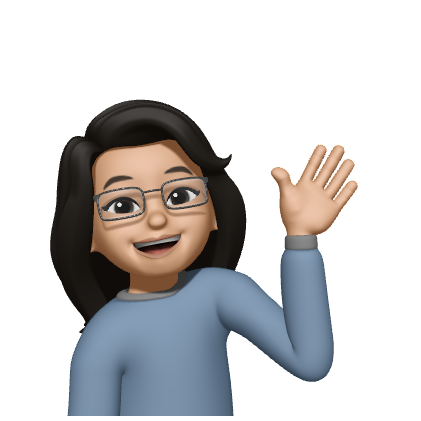

  
  <h1> Hi! 👋 I'm Anagha. I'm a Mobile Application Developer! 📱</h1>
  

### Here's a little about myself!

- 📱 I'm an iOS and Flutter developer
- 👩🏻‍💻 I LOVE coding!
- 🕺🏻 I enjoy converting UI to code!
- 👀 My other interests include Cyber Security, Software Testing, & Computer Forensics 🤓
- 💻 Currently learning React!

### Tech I've used
- iOS: Swift, SwiftUI, Objective-C, Cocoa, App Storage, UIKit, Core Data, Core Bluetooth, MVVM, MVC, Notifications
- Flutter: Widgets, Health, Maps, Google Speech-to-Text, Camera, Notifications, Streams, 
- Other Tech: Firebase, Google Cloud Services, Mapbox, Zeplin, Postman, GraphQL, RayzorPay, RESTful APIs
- Other Languages: HTML, Python, C, C++, Javascript, Java, Kotlin
